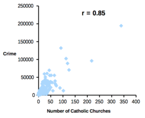

# Identify direct correlation by using Graphical Lasso algorithm

1. The problem
2. Indirect correlation and Direct (or partial) correlation
3. Graphical Lasso
4. Example using store purchase history

## The problem
In US, there is a strong correlation between churches and the number of crimes, which is a well-known correlation of suspected causality.
The correlation between these two variables is an indirect correlation generated by the common factor of "population".
More crime occurs in more populated cities, and more churches are needed in more populated cities.

<table>
    <th width=40%>
        Crimes statistics aggregated by cities in the United States and by number of Catholic churches in the same cities. 
        <a href="https://biostatistics.letgen.org/mikes-biostatistics-book/correlation-similarity-and-distance/data-aggregation-and-correlation/">https://biostatistics.letgen.org/mikes-biostatistics-book/correlation-similarity-and-distance/data-aggregation-and-correlation/</a>
    </th>
    <th>
        
    </th>
</table>

When a correlation is found between two variables, it is always one of our interest whether the relationship is a direct correlation or an indirect correlation that is confirmed due to some potential common factors.

## Indirect correlation and direct correlation
When calculating the correlation between two variables in a given data set, it generally means that you are looking at an INDIRECT correlation. As in the church example above, there can be a common factor between the two variables that may be correlated with each other. In this sense, confirmed relationship can be an INDIRECT relationship.  
On the other hand, DIRECT correlation or PARTIAL correlation is an indicator that expresses the DIRECT correlation between two variables by removing the influence of the common factor. In church case above, if we focus only on cities with the same population and correlate the number of churches with the number of crimes, we can find a DIRECT correlation between the two variables.

Formally, the partial correlation between $X$ and $Y$ given a set of n controlling variables $Z = {Z_1, Z_2, ..., Z_n}$, written $ρ_{XY|Z}$, is the correlation between the residuals $e_X$ and $e_Y$ resulting from the linear regression of $X$ with $Z$ and of $Y$ with $Z$, respectively. The first-order partial correlation (i.e., when n = 1) is the difference between a correlation and the product of the removable correlations divided by the product of the coefficients of alienation of the removable correlations.

$$
X: Num\ of\ churchs \\
Y: Num\ of\ crimes \\
Z: Num\ of\ population \\
e_X = X - LinearRegression(Z)_{target:X} \\
e_Y = Y - LinearRegression(Z)_{target:Y} \\
Corr_{partial} (=Corr_{direct})  = Corr(e_X, e_Y) \\
Corr_{indirect} = Corr(X, Y) \\
$$

citation: <a href="https://en.wikipedia.org/wiki/Partial_correlation">https://en.wikipedia.org/wiki/Partial_correlation</a>

Intuitive interpretation of above math  
- $X$ and $Y$ are both affected by $Z$.
- We want to remove as much of the $Z$ influence as possible.
- The effect of $Z$ on $X$ is represented by a linear regression model, and the residual($e_X$) is the value after removing the factor of variation caused by $Z$.
- Therefore, if we calculate the correlation between $e_X$ and $e_Y$, we can check the direct correlation without the effect of $Z$.

## Graphical Lasso
There is often a use case where there are 1000 variables in a given data set and we want to calculate the PARTIAL correlation coefficient of all pairs and focus only on the variable pairs with strong PARTIAL correlation.  
For example, there is a use case that analyzes the strongly correlated pairs of sensors in a factory and detects abnormalities based on the collapse of the correlation. Other example include understanding consumer preferences by identifying products with strong correlations as sales trends based on the store's purchase history, and capturing changes in consumer preferences as these correlations change.
In order to calculate PARTIAL correlation coefficients for all pairs between a large number of variables, following three step calculation becomes very computationaly expensive.
1. create a linear regression model
2. calculate the residuals
3. calculate the correlation

Suppose $N_{variables}: Num \ of \ variables$, $N_{models}: Num \ of \ models$ then $N_{models}$ will caluculated as below.
$$
N_{models} = _{N_{variables}}C_{2} = O(N_{variables}^2)
$$

Since computational complexity of creating single liear regression model is below,

$$
n: Num \ of \ record \ in \ dataset \\
k: Num \ of \ variables \ in \ model \\
O(a\ linear\ regression\ model) = O(k^3 + k^2*n) \\
$$

Total computational complexity will be up to $O(ttl) = O(N_{variables}^2 * (k^3 + k^2*n))$. 
It is clear that it is very difficult to calculate PARTIAL correlation matrix with this approach in a large data set with many variables and many records.  
By making an assumption, Graphical Lasso was able to solve this problem and calculate PARTIAL correlation matrix with a very small amount of computation.  
This assumption is that as $X_1, X_2, ... X_N$ represents a variable in the data set, Graphical Lasso assume that they all follow a multivariate normal distribution.  
This is a very strong assumption, so we need to be careful when using this algorithm, but it has the advantage of being able to calculate PARTIAL correlation coefficients for very large data sets, if the data set can be transformed appropriately to satisfy this assumption.

## Example using store purchase history
Data set is from this(https://www.kaggle.com/c/favorita-grocery-sales-forecasting/data) Kaggel competition.
Purchase history of a supermarket in Ecuador. While demand forecasting was the main theme of the Kaggle competition, another interesting topic for analysis was how the major earthquake in April 2016 Ecuador Muisune changed consumers' purchasing habits in supermarkets.
Example notebooks 'product_selling_relationship' analyze this by calculating PARTIAL correlation.
